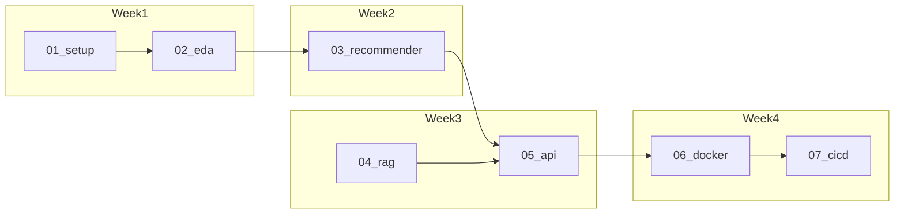

# BGG Board Game Assistant — Implementation Guide

Step-by-step guides for building a self-hosted board game recommender and rulebook RAG chatbot. Work through one component at a time: **read → review → implement → verify checkpoints → mark done → next step**.

## Architecture

```mermaid
flowchart TB
    subgraph client [Client]
        st[Streamlit]
    end

    subgraph api_layer [API Layer]
        fastapi[FastAPI]
        rec[/recommend]
        ask[/ask]
        fastapi --> rec
        fastapi --> ask
    end

    subgraph ml [ML and Data]
        parquet[(Parquet)]
        mlflow[MLflow]
        als[ALS Model]
        content[Content Index]
        parquet --> als
        parquet --> content
        mlflow --> als
        mlflow --> content
    end

    subgraph rag [RAG Stack]
        pdfs[/rulebooks PDFs]
        chroma[(ChromaDB)]
        embed[MiniLM Embeddings]
        ollama[Ollama LLM]
        pdfs --> embed
        embed --> chroma
        chroma --> ollama
    end

    st --> fastapi
    rec --> als
    rec --> content
    ask --> chroma
    ask --> ollama
```

## Weekly Timeline

| Week | Steps | Est. hours | Exit criteria |
|------|-------|------------|---------------|
| **W1** | [01-project-setup](steps/01-project-setup.md), [02-data-and-eda](steps/02-data-and-eda.md) | 5–10h | Parquet in `data/processed/`; EDA notebook runs; schema documented |
| **W2** | [03-recommender](steps/03-recommender.md) | 5–10h | ALS + content model in MLflow; offline eval metrics logged; CLI inference works |
| **W3** | [04-rag-pipeline](steps/04-rag-pipeline.md), start [05-api-and-frontend](steps/05-api-and-frontend.md) | 5–10h | Chroma index from `/rulebooks`; Ollama answers grounded questions locally |
| **W4** | finish [05](steps/05-api-and-frontend.md), [06-docker-and-deploy](steps/06-docker-and-deploy.md), [07-ci-cd-and-readme](steps/07-ci-cd-and-readme.md) | 5–10h | `docker compose up` on Pi; Streamlit usable; CI green; README portfolio-ready |



## How to Use These Guides

1. Open the next **unchecked** step below.
2. Read all tasks and subtasks; adjust paths or versions if your environment differs.
3. Implement only what that step describes — avoid scope creep.
4. Run every **checkpoint** at the bottom of the step file.
5. Check the box in the progress table below.
6. Move to the next step.

## Progress Checklist

| Step | Document | Status |
|------|----------|--------|
| 01 | [Project Setup](steps/01-project-setup.md) | ☑ |
| 02 | [Data & EDA](steps/02-data-and-eda.md) | ☑ |
| 03 | [Recommender](steps/03-recommender.md) | ☐ |
| 04 | [RAG Pipeline](steps/04-rag-pipeline.md) | ☐ |
| 05 | [API & Frontend](steps/05-api-and-frontend.md) | ☐ |
| 06 | [Docker & Deploy](steps/06-docker-and-deploy.md) | ☐ |
| 07 | [CI/CD & README](steps/07-ci-cd-and-readme.md) | ☐ |

## Reference Docs

| Document | Purpose |
|----------|---------|
| [folder-structure.md](architecture/folder-structure.md) | Full repo tree and file responsibilities |
| [docker-compose-spec.md](architecture/docker-compose-spec.md) | Complete Docker Compose reference |
| [pitfalls-and-mitigations.md](architecture/pitfalls-and-mitigations.md) | Pi/Ollama, reindex, ALS cold start, Spark on Pi |

## Tech Stack Summary

| Component | Technology |
|-----------|------------|
| Frontend | Streamlit (Recommender / Chatbot tabs) |
| API | FastAPI (`/recommend`, `/ask`) |
| Recommender | PySpark MLlib ALS + content-based filter |
| RAG embeddings | sentence-transformers `all-MiniLM-L6-v2` |
| Vector store | ChromaDB (persistent) |
| LLM | Ollama (`phi3:mini` on Pi, `mistral:7b` on dev) |
| RAG orchestration | LangChain |
| PDF parsing | PyMuPDF (~500-token chunks) |
| Experiment tracking | MLflow |
| Infra | Docker Compose on home server |

## Primary Use Case

Discover board games to play **with 2 players** (e.g. with a partner) based on games you already enjoy, plus ask natural-language questions about rulebook PDFs stored locally.
