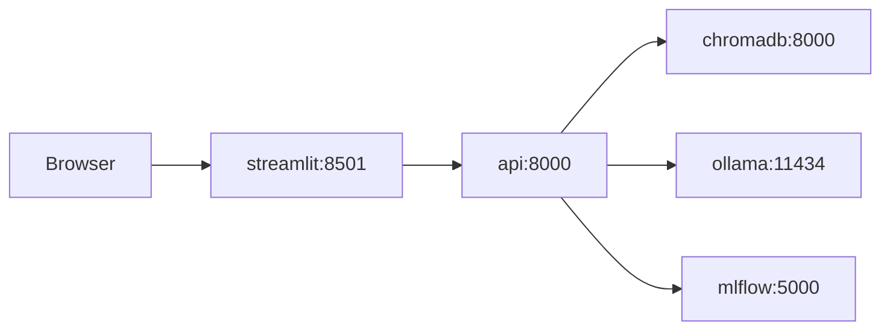

# Docker Compose Specification

Reference `docker-compose.yml` for the full BGG stack. Implement in [Step 06](../steps/06-docker-and-deploy.md).

## Services Overview

| Service | Image / Build | Port (host) | Purpose |
|---------|---------------|-------------|---------|
| `ollama` | `ollama/ollama:latest` | 11434 | Local LLM inference |
| `chromadb` | `chromadb/chroma:latest` | 8001 → 8000 | Persistent vector store |
| `mlflow` | `ghcr.io/mlflow/mlflow:v2.14.3` | 5000 | Experiment tracking + model registry |
| `api` | `docker/Dockerfile.api` | 8000 | FastAPI (`/recommend`, `/ask`) |
| `streamlit` | `docker/Dockerfile.streamlit` | 8501 | Web UI |

## Complete `docker-compose.yml`

```yaml
services:
  ollama:
    image: ollama/ollama:latest
    container_name: bgg-ollama
    volumes:
      - ollama_models:/root/.ollama
    ports:
      - "11434:11434"
    restart: unless-stopped
    # Raspberry Pi: uncomment memory limit
    # deploy:
    #   resources:
    #     limits:
    #       memory: 3g

  chromadb:
    image: chromadb/chroma:latest
    container_name: bgg-chroma
    environment:
      - IS_PERSISTENT=TRUE
      - ANONYMIZED_TELEMETRY=FALSE
    volumes:
      - ./chroma_data:/chroma/chroma
    ports:
      - "8001:8000"
    restart: unless-stopped

  mlflow:
    image: ghcr.io/mlflow/mlflow:v2.14.3
    container_name: bgg-mlflow
    command: >
      mlflow server
      --host 0.0.0.0
      --port 5000
      --backend-store-uri sqlite:////mlflow/mlflow.db
      --default-artifact-root /mlflow/artifacts
    volumes:
      - ./mlruns:/mlflow
    ports:
      - "5000:5000"
    restart: unless-stopped

  api:
    build:
      context: .
      dockerfile: docker/Dockerfile.api
    container_name: bgg-api
    env_file: .env
    environment:
      - MLFLOW_TRACKING_URI=http://mlflow:5000
      - CHROMA_HOST=http://chromadb:8000
      - OLLAMA_BASE_URL=http://ollama:11434
      - RULEBOOKS_DIR=/rulebooks
      - BGG_DATA_DIR=/data
    volumes:
      - ./data:/data:ro
      - ./rulebooks:/rulebooks:ro
      - ./chroma_data:/chroma_data
    ports:
      - "8000:8000"
    depends_on:
      - chromadb
      - ollama
      - mlflow
    restart: unless-stopped
    healthcheck:
      test: ["CMD", "curl", "-f", "http://localhost:8000/health"]
      interval: 30s
      timeout: 10s
      retries: 3
      start_period: 60s

  streamlit:
    build:
      context: .
      dockerfile: docker/Dockerfile.streamlit
    container_name: bgg-streamlit
    environment:
      - FASTAPI_URL=http://api:8000
    ports:
      - "8501:8501"
    depends_on:
      api:
        condition: service_healthy
    restart: unless-stopped

volumes:
  ollama_models:
```

## Volume Mounts

| Host path | Container path | Service | Mode | Contents |
|-----------|----------------|---------|------|----------|
| `./chroma_data` | `/chroma/chroma` | chromadb | rw | Vector index persistence |
| `./mlruns` | `/mlflow` | mlflow | rw | SQLite DB + experiment artifacts |
| `ollama_models` (named) | `/root/.ollama` | ollama | rw | Downloaded LLM weights |
| `./data` | `/data` | api | ro | Parquet + exported models |
| `./rulebooks` | `/rulebooks` | api | ro | PDF rulebooks |

## Environment Variables

### Shared (`.env` file)

```bash
# Data paths (overridden in compose for containers)
BGG_DATA_DIR=./data
RULEBOOKS_DIR=./rulebooks

# ML / RAG
MLFLOW_TRACKING_URI=http://localhost:5000
CHROMA_HOST=http://localhost:8001
OLLAMA_BASE_URL=http://localhost:11434
OLLAMA_MODEL=phi3:mini

# Recommender
MLFLOW_MODEL_NAME=bgg-recommender
MLFLOW_MODEL_STAGE=Production

# Spark (training only — not used in api container at runtime)
SPARK_MASTER=local[*]
```

### Service-specific overrides (set in compose)

The `api` service overrides URLs to use Docker network hostnames (`mlflow`, `chromadb`, `ollama`).

The `streamlit` service sets `FASTAPI_URL=http://api:8000`.

## Network Topology



All services share the default Compose network. Only `ollama`, `chromadb`, `mlflow`, `api`, and `streamlit` expose ports to the host.

## First-Time Bootstrap

After `docker compose up -d`:

```bash
# Pull LLM model into Ollama volume
docker exec bgg-ollama ollama pull phi3:mini

# Index rulebooks (run from api container or host with env pointing to services)
docker exec bgg-api python scripts/index_rulebooks.py

# Verify health
curl http://localhost:8000/health
curl http://localhost:8501
```

## Raspberry Pi Adjustments

| Setting | Dev machine | Raspberry Pi |
|---------|-------------|--------------|
| `OLLAMA_MODEL` | `mistral:7b` or `phi3:mini` | `phi3:mini` (required on 4–8 GB RAM) |
| Ollama memory limit | none | `3g` in compose |
| ALS training | local Spark | **offload to laptop**; ship `data/models/` only |
| Swap | optional | enable 2 GB swap |
| `OLLAMA_NUM_PARALLEL` | default | `1` |

## Port Conflicts

If ports clash with existing services on your Pi dashboard:

| Service | Default | Alternative |
|---------|---------|-------------|
| MLflow | 5000 | 5001 |
| Chroma | 8001 | 8002 |
| API | 8000 | 8080 |
| Streamlit | 8501 | 8502 |

Update both `docker-compose.yml` and `.env.example` consistently.

## What Is NOT in Compose

- **Spark** — training runs on dev machine via notebooks/scripts; inference uses pre-exported artifacts.
- **Training jobs** — one-off `docker compose run --rm api python scripts/train_recommender.py` if needed, but prefer laptop for Spark.
